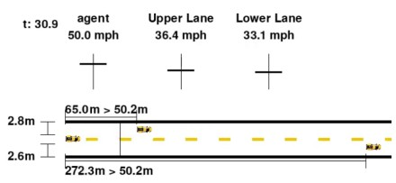

# Safe Car Env

## Installation

```bash
conda create -y -n safe-car-env python=3.12
conda activate safe-car-env

# install pytorch: https://pytorch.org/get-started/locally/
# an example for a cpu-only install is the following line
conda install pytorch torchvision torchaudio cpuonly -c pytorch

pip install -e .
```

## Run Environments

There are two environments provided: double integrator and car.
The files in the `scripts` directory provide a minimal implementation for how to
use a controller within each environment.

### Double Integrator Environment

The double integrator is a simple test case that runs quickly and is easy to
debug. The agent controls acceleration and receives a reward every time it
further to the left on the x-axis so it is incentived to choose maximum
negative acceleration. At the same time there is a constraint that it must not
hit a wall located at the origin.

The environment also includes a controller to achieve a given
velocity. For instance, if we want the agent to achieve a speed
of -1 meter per second, we can use the following:

```bash
cd scripts
python run_dbl_int.py --tgt_speed -1
```


### Car Environment

The car environment consists of a a self-driving car
doing adaptive cruise control with lane merging. In front
of the self-driving car is a lead car in each lane.
The lead car chooses a random speed at random times
while the self-driving car must avoid collisions while
attempting to achieve the target velocity. It must change
lanes to reach this target velocity because the two lead
cars will likely travel at different speeds. The self-driving
car controls acceleration and the steering wheel angle.
An example of controlling it to run at 50 miles per hour is
can be run as follows:

```bash
cd scripts
python run_car.py --tgt_speed 50
```



## Style Guide

See `pyproject.toml` and `.flake8` for the style guide.
The code should pass these checks

```bash
pip install -U flake8 pylint mypy isort black

# isort and black automatically update the code to be compatible
isort scripts safe_car_env
black scripts safe_car_env

# flake8 and pylint will throw errors when code is not compatible
flake8 scripts safe_car_env
pylint scripts safe_car_env
```
